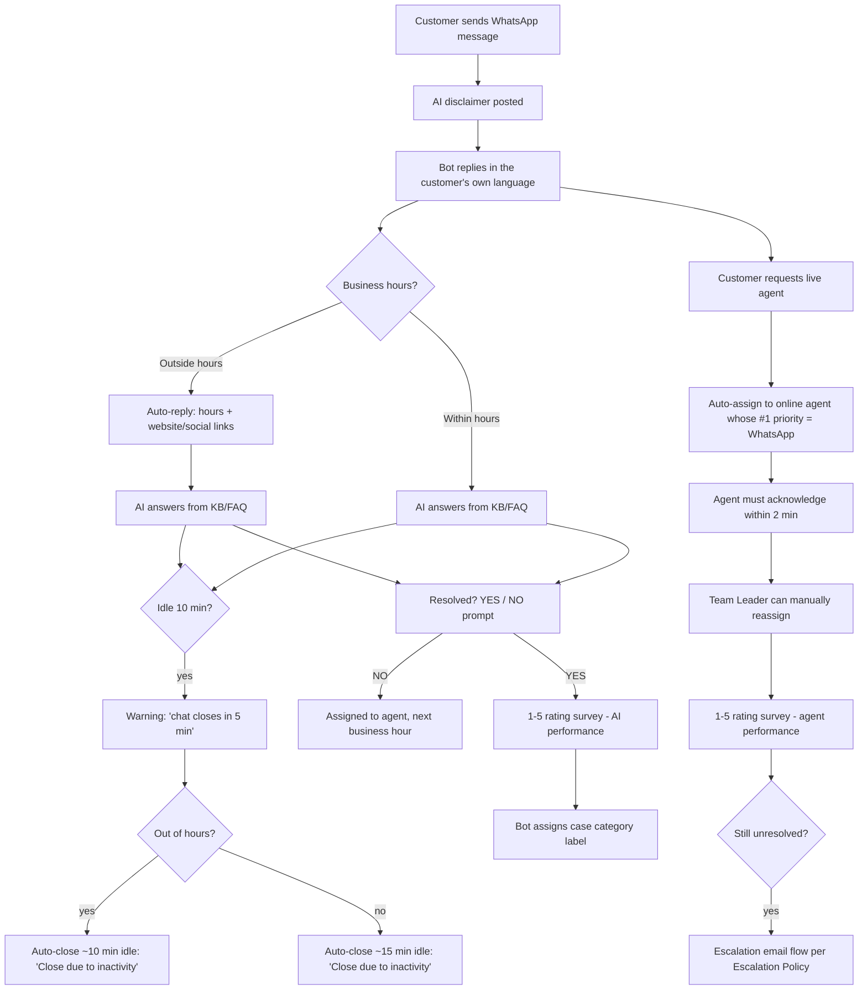
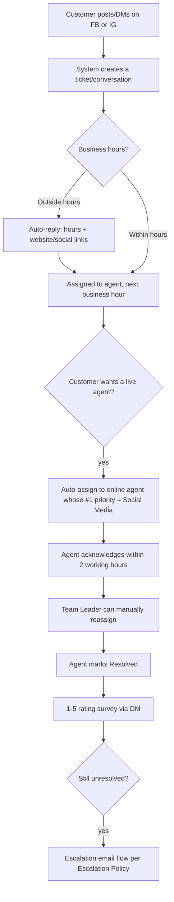
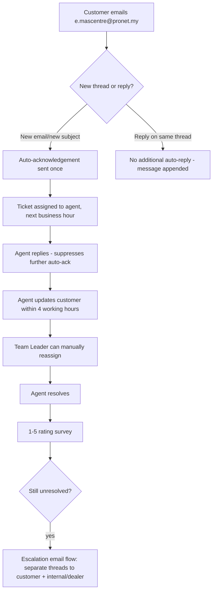
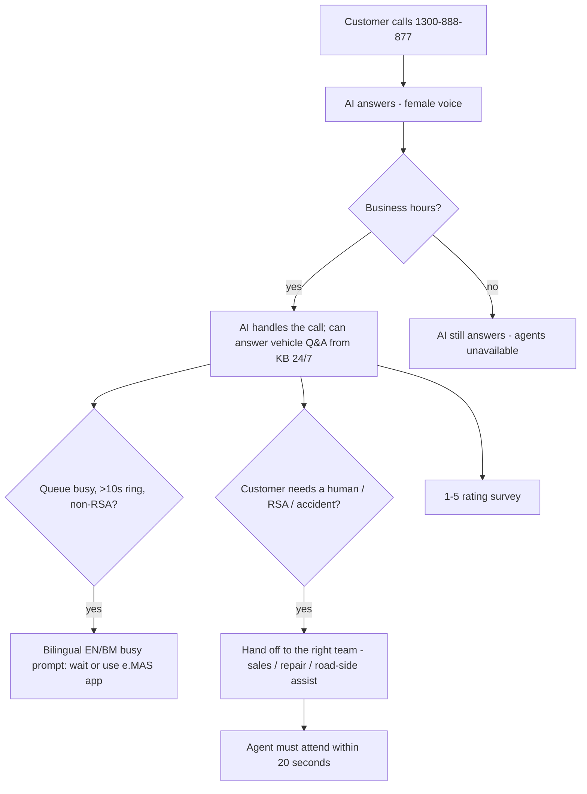
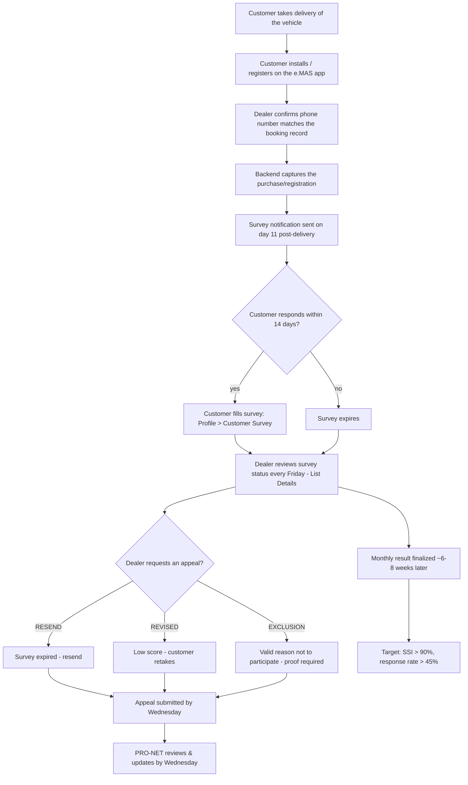

# CRM Channel Business Process Flows & UI Testing Guide

**Sources:**
- `docs/client-materials/CRM Process Flow (1).xlsx` — target SOP per channel
  (sheets: WhatsApp, Social Media, Email, IVR Call, SSI Process).
- `docs/client-materials/Proton x Devoteam _ CRM System Update – 2026_07_28 …
  Notes by Gemini.pdf` — live demo of the CRM to Proton/PRO-NET, 2026-07-28.

**Scope of this doc:** for each channel (**WhatsApp**, **Social Media**,
**Email**, **Phone/IVR**), and the one process that runs **outside** those
channels (**SSI post-delivery survey**), give (1) the target business-process
flow as a diagram, and (2) a **UI-only** walkthrough — clicks in the Chatwoot
CRM, no pytest/docker required — a tester can use to verify each SOP step.
Every step is tagged with what's actually testable today per the 2026-07-28
demo.

**Not duplicated here** — see instead:
- `crm-process-flow-testing-guide.md` — automated pytest suites + log-grep
  commands for engineers verifying the code, not the UI.
- `crm-process-flow-runbook.md` — how to wire/activate the lifecycle engine
  per tenant (env vars, webhook registration).
- `proton-crm-gap-analysis-2026-07-27.md` — full requirement-by-requirement
  build status (PDF requirements ↔ code), including the Customer 360/DMS gap.
- `proton-crm-knowledge-menu-features-and-capabilities.md` — full tour of the
  Knowledge (persona/FAQ/KB) admin screens referenced below.

---

## 1. Legend

| Mark | Meaning |
|---|---|
| ✅ **Live** | Click through it today in the Chatwoot UI exactly as described. |
| ⚠️ **Partial** | The UI/setting exists, but a sub-part is unwired, mocked, or needs data/config first (noted inline). |
| ❌ **Not built** | No UI surface yet — needs further development. |
| 🔲 **Decision pending** | Two implementation paths exist; Proton/PRO-NET needs to pick one before it's finished. |

---

## 2. Where cross-channel settings live in the CRM UI (bird's-eye)

These admin surfaces are shared by every channel below, so they're indexed
once here instead of repeated per section.

| Capability | UI path | Notes |
|---|---|---|
| Business hours / out-of-office reply | **Settings → Inboxes → *(inbox)* → Business Hours** | Read natively by the agent's business-hours check — this is the single source of truth for "in hours / out of hours" branching. |
| Idle-warning / auto-close minutes | Same **Business Hours** screen, section **"Inactivity & auto-close"** — fields `Warn after idle (min)`, `Close grace — in business hours (min)`, `Close grace — out of hours (min)`, `Resolution-confirm grace (min)`, plus the 8 lifecycle-message textareas (idle warning / chat closed / resolution prompt / etc.) | *Confirmed:* these fields **do write through** (saved via the same "Update" submit, `PUT /kb/inboxes/{id}/timing`) — empty = inherit the tenant's env-var default. Not display-only. |
| Agent priority / auto-assignment per channel | **Settings → Inboxes → *(inbox)* → Collaborators**, section **"Agent Channel Priorities"** | Per-agent table: `Primary channel` dropdown + `Also handles` toggle-pills. *Correction:* no "earliest conversation first vs. round-robin" toggle exists in this section — if that behavior is needed, it's the plain native Chatwoot "Conversation Assignment" accordion elsewhere on the same page; verify live before relying on this. |
| Persona, disclaimer, welcome/handoff messages, temperature, language | **Settings → Knowledge → Settings** (pick the assistant from the dropdown at top) | *Correction:* **not** the "Assistants" sub-item — that screen is just a bare list/rename modal (Name, Description, Product). The actual persona editor (`System instructions`, `Temperature`, `Language`, `Guardrails`, all 10 lifecycle `Messages` fields) lives on **Settings**, one level over. Empty persona = today's default disclaimer text, byte-identical. |
| FAQ entries (manual Q&A) | **Settings → Knowledge → FAQs** | Bulk CSV upload is future work — one-by-one only today. |
| Uploaded documents (KB grounding) | **Settings → Knowledge → Uploads** (button `Upload file` / `+ Add text`) | *Correction:* **not** the "Documents" sub-item — that tab is a **read-only** listing of the separate Vertex AI corpus. The actual operator upload/ingest screen is **Uploads**, gated behind `KNOWLEDGE_PG_ENABLED` (shows a "not enabled" message instead of a 404 when off). Status column shows `indexed`/`pending`/`failed` — content isn't grounded until `indexed`. **Update 2026-08-03:** `KNOWLEDGE_PG_ENABLED=true` on proton — the screen is live, not gated. Patch `0033` also fixed a bug where a failed load/remove showed a raw "404: Not Found" alert instead of the friendly "not enabled" message. |
| Reporting dashboards (dealer escalation, case aging/WIP, category × vehicle-model, volume by type) | **Reports** menu → new native report tabs, plus generalized CSV export on each | ⚠️ Code-complete (`reporting-metrics-extensions` run, 2026-08-03) but **not yet in the live Chatwoot bundle** — needs patches `0034`/`0035` rebuilt via Cloud Build + redeployed. CSV export routes are `x-api-key`-gated (`METRICS_API_KEY`), same as the JSON routes. |
| Roadside-Assistance (RSA) incident log | New standalone entry/report page (patch `0035`) | ⚠️ Code-complete, default-off behind `RSA_ENABLED`+`RSA_DATABASE_URL`. Needs a per-tenant Postgres DB provisioned (mirrors the pgvector-KB rollout) + image rebuild to go live. See IVR-7 below for how this relates to the call-routing RSA flow. |
| Attach an assistant/persona to a specific inbox | **Settings → Knowledge → Inboxes** | |
| Test the bot before going live | **Settings → Knowledge → Playground** | |
| Agent-facing "Ask Copilot" | Inside any open conversation → reply-box AI-actions menu → **Ask Copilot** (opens a right-side slide-in panel) | Needs the conversation's KB to be grounded first. |
| Suggested reply / "FAQ Assist" | Conversation reply box → same AI-actions menu → suggestion icon | "FAQ Assist" is informal shorthand, not on-screen text. Matches on the customer's last message, not the full thread; results show a `Sources:` line with clickable links when grounded. |
| Labels / case categorization | Conversation → right sidebar → **Conversation Actions → Labels** | Stock/unforked Chatwoot UI. Flat list today — no parent-category → subcategory dependency yet (PRO-NET asked for this in the meeting). |
| CSAT / rating-survey results | **Reports → CSAT** | |
| SLA compliance | **Reports → SLA**, and **SLA Policies** to configure | *Correction:* `SLA Policies` is a **standalone top-level left-sidebar icon** (timer icon), not nested under the gear-icon Settings menu. Only visible with the `sla.manage` permission, and only exists at all when `RBAC_ENABLED=true` for the tenant — Chatwoot Community has no native SLA-config UI otherwise. |
| Manual reassignment audit trail | **Audit Log** | *Correction:* also a **standalone top-level left-sidebar icon** (scroll icon), not under Settings — needs `audit.view` permission + `RBAC_ENABLED=true`. Covers the "Team Leader can manually reassign" requirement on every channel. |
| Roles & permissions | **Roles & Permissions** | *Correction:* also a **standalone top-level left-sidebar icon** (shield icon), not under Settings — needs `roles.manage` permission + `RBAC_ENABLED=true`. Includes a **"Chatwoot access" section** (radio: `Manage all conversations` / `Unassigned conversations only` / `My conversations only`, plus `Contacts`/`Reports`/`Knowledge base` checkboxes) controlling native Chatwoot visibility per role, separate from the admin-page permissions above it. |
| Contact edit / merge duplicate contacts | Contact panel → **⋯ → Merge/Edit** | Stock/unforked Chatwoot UI — exact labels not independently verified against this repo's patches, but no patch touches this panel's actions. |
| Customer's prior conversations across channels | Contact panel → **Previous Conversations** | Stock/unforked Chatwoot UI, same caveat as above. |

> **Note on the three admin-only pages above (SLA Policies / Audit Log / Roles & Permissions):** if a tester's account doesn't show these icons in the left sidebar at all, that's expected when `RBAC_ENABLED` is off for the tenant or the account lacks the specific permission — it isn't a bug to file.

---

## 3. WhatsApp

### 3.1 Business process flow

> SOP text ambiguity (flagged in the gap analysis, unresolved as of the demo):
> the workbook gives idle-**warning** at 10 min for both branches, but the
> idle-**close** value differs (10 min out-of-hours vs. 15 min in-hours). The
> current lifecycle engine models this as `WARN=10min` +
> `CLOSE_GRACE=5min` (in-hours → 10+5=15 total, matching the in-hours figure)
> and `OUT_OF_HOURS_GRACE=0min` (10+0=10 total, matching the out-of-hours
> figure) — worth confirming with Proton that this split is the intended
> reading before sign-off.

### 3.2 UI test walkthrough

| # | Step | Where in the UI | How to verify | Status |
|---|---|---|---|---|
| WA-1 | Disclaimer on first message | Open the WhatsApp inbox, send a message from a test WhatsApp number | Bot posts the AI-use disclaimer within seconds | ✅ Live |
| WA-2 | Same-language reply | Send in Bahasa vs. English | Bot replies in the language the customer used | ⚠️ Partial — **root cause fixed 2026-08-03** (`be7b715`/`6760596`: persona/language field was silently overriding "match the customer's language" instead of acting as a fallback) and deployed to proton (agent+backend rebuilt). Downgraded from ❌ known-bug to **pending a real WhatsApp smoke test only** — no code work left, just needs someone to confirm live. |
| WA-3 | Out-of-hours auto-reply | Set inbox Business Hours to a window that excludes "now", send a message | Auto-reply with the hours/website text posts instead of the bot answering | ✅ Live (needs Business Hours configured per §2) |
| WA-4 | FAQ-grounded answer | Ask a question covered by an uploaded FAQ/document | Bot answers using that content, not a generic reply | ⚠️ Partial — works once KB content is populated & "grounded". **Update 2026-08-03:** if grounding finds nothing AND a document is still `pending` indexing, the bot now says "still processing" instead of guessing (`91a412e`, deployed) — the demo's failure mode (silent bad answer) is fixed; a genuinely-missing/never-uploaded topic still returns a generic reply as expected. |
| WA-5 | Idle warning → auto-close | Leave the conversation idle past the configured minutes | Bot posts the 5-min warning, then the auto-close + "resolved? YES/NO" message | ✅ Live (see threshold note in §3.1) |
| WA-6 | Resolution gate | Reply `NO` / `YES` to the prompt | `NO` reopens to active; `YES` moves to the rating survey | ✅ Live |
| WA-7 | CSAT survey | Reply `1`–`5` to the survey | Rating appears under **Reports → CSAT**; conversation closes | ✅ Live |
| WA-8 | Auto-categorization on bot resolution | Resolve via the bot flow (not a human) | A `category_*` label is applied — check the conversation's Labels | ⚠️ Partial — requires `LIFECYCLE_AUTO_CATEGORIZE=true` and the category list configured; **the real taxonomy is now provisioned live on proton (2026-08-03)** — `case_category`/`case_subcategory` custom attributes (Sales/Aftersales/Apps/Charging/Roadside Assistance/General Enquiry/Complaint, 26 subcategories), reconciled against Proton's actual reporting decks. A doubled-prefix bug (`category_category_inquiry`) was also fixed. Hierarchical main→sub *dependency in the label picker UI* (as PRO-NET requested) still isn't built — labels remain a flat list to pick from. |
| WA-9 | Escalate to live agent | Ask for a human agent | Assigned to the online agent with WhatsApp as priority-1 (Settings → Inboxes → Collaborators → Agent Priorities) | ✅ Live |
| WA-10 | Manual reassignment | Team Leader reassigns the conversation in the UI | Assignee changes; entry appears in **Settings → Audit Log** | ✅ Live |
| WA-11 | Escalation email | Apply the **escalate** label to a conversation | PIC receives an email (and WhatsApp alert, if enabled); check Escalation Policy mapping | ✅ Live, but attachments (photos/videos on the conversation) are **not yet forwarded** — text-only today |
| WA-12 | Voice notes / image / video from customer | Send a voice note, image, or video in WhatsApp | Bot should transcribe/process it | ⚠️ Partial — text-only in the 2026-07-28 demo; presenter attributed this live to Meta Business/WABA verification on the Twilio sandbox number, though that's unconfirmed. **Update 2026-08-03:** `WHATSAPP_MEDIA_UNDERSTANDING_ENABLED=true` is now live on proton (agent/backend redeployed) — audio + image understanding should work. **Still needs a real WhatsApp voice-note/photo smoke test** to confirm (couldn't be done in the dev sandbox, no real WhatsApp number available). Video understanding remains genuinely unbuilt (audio/image only), out of scope by design. |
| WA-13 | "Which vehicle is this customer's?" lookup | Try to find the customer's vehicle/registration from the conversation | — | ❌ Not built — needs the Customer 360/DMS integration (see gap-analysis §6) |

### 3.3 Detailed step-by-step

The WhatsApp inbox itself is stock, unforked Chatwoot (a native **Twilio-channel** inbox) — there's no enforced naming convention, so confirm with your admin which inbox in the left sidebar receives WhatsApp traffic before starting (Settings → Inboxes lists every inbox and its channel type).

**WA-1 — Disclaimer on first message**
1. In the left sidebar's Inboxes list, open the WhatsApp inbox.
2. From a test WhatsApp number, send any message to the number connected to that inbox.
3. A new conversation should appear in the inbox's list within a few seconds — open it.
4. Confirm the bot's very first reply is the AI-use disclaimer text, before any other content.

**WA-2 — Same-language reply**
1. In that conversation (or a fresh one), send a message in Bahasa (e.g. "Selamat pagi, saya nak tanya tentang kereta saya").
2. Note the language of the bot's reply.
3. Send a second message in English and note that reply's language too.
4. As of 2026-08-03 the underlying override bug is fixed and deployed — expect the bot to now match the customer's language on both messages. If it still answers in English, that's a regression worth filing, not the known pre-fix behavior.

**WA-3 — Out-of-hours auto-reply**
1. Go to **Settings → Inboxes → *(WhatsApp inbox)* → Business Hours**.
2. In the native per-day schedule table, set today's window to exclude the current time (e.g. if it's 2pm, set the close time to 1pm) and save.
3. Send a WhatsApp message from the test number.
4. Confirm the reply is the hours/website auto-reply, not a normal AI answer.
5. Revert the Business Hours window afterward so later tests aren't affected.

**WA-4 — FAQ-grounded answer**
1. Add content first: **Settings → Knowledge → FAQs → + New entry** (a Question/Answer pair), *or* **Settings → Knowledge → Uploads → Upload file / + Add text** (note: Uploads is gated behind `KNOWLEDGE_PG_ENABLED` — if it shows "not enabled," only manual FAQs are available on this tenant).
2. If you uploaded a document, wait until its Status column shows `indexed` (not `pending`/`failed`).
3. Send a WhatsApp message asking exactly the question you added.
4. Confirm the bot's answer reflects that content rather than a generic reply. If the upload is still `pending`, expect an explicit "still processing" reply now (not a silent generic answer, which was the 2026-07-28 demo gap) — wait for `indexed` and retry to see the real grounded answer.

**WA-5 — Idle warning → auto-close**
1. Check the configured thresholds first: **Settings → Inboxes → *(WhatsApp inbox)* → Business Hours**, scroll to the **"Inactivity & auto-close"** section, note `Warn after idle (min)` and both `Close grace` values.
2. Send a message to open/continue a conversation and get a bot reply.
3. Wait without replying for the warn-threshold number of minutes.
4. Confirm the bot posts the `Idle warning message` text.
5. Keep waiting past the grace period; confirm the bot then posts the `Chat closed message` followed by the resolution Y/N prompt.

**WA-6 — Resolution gate**
1. Get the conversation to the resolution prompt ("Is your case resolved? Please reply YES or NO" — either via WA-5's idle flow or after the bot answers a question).
2. Reply `NO` — confirm the conversation stays/returns to open (not resolved).
3. In a separate test conversation, reply `YES` — confirm it proceeds to the rating-survey message next.

**WA-7 — CSAT survey**
1. Continue from a `YES` reply (WA-6).
2. Reply with a number `1`–`5` to the rating-survey message.
3. Go to **Reports → CSAT** and confirm the new rating is listed.
4. Confirm the conversation's status is now Resolved.

**WA-8 — Auto-categorization on bot resolution**
1. Ask engineering to confirm `LIFECYCLE_AUTO_CATEGORIZE=true` and a category list are set for this tenant (env var, not a UI toggle) — on proton this is the 7-division/26-subcategory taxonomy provisioned 2026-08-03.
2. Run a full bot-only resolution (WA-6 `YES` → WA-7) with no human agent involved.
3. Open the resolved conversation → right sidebar → **Conversation Actions → Labels**.
4. Confirm a single, correctly-prefixed `category_*` label was applied automatically (e.g. `category_sales`, not a doubled `category_category_sales` — that bug is fixed) — flat list only, no sub-category dependency in the picker yet.

**WA-9 — Escalate to live agent**
1. Go to **Settings → Inboxes → *(WhatsApp inbox)* → Collaborators → Agent Channel Priorities**.
2. Confirm at least one agent has WhatsApp set as `Primary channel` and is currently online.
3. From the test WhatsApp number, ask for a human agent.
4. Confirm the conversation's Assignee (conversation header) becomes that agent.

**WA-10 — Manual reassignment**
1. As a Team Leader/admin, open any assigned WhatsApp conversation.
2. Click the current assignee in the conversation header and pick a different agent.
3. Go to the standalone **Audit Log** page (top-level left-sidebar icon — only visible with the `audit.view` permission when `RBAC_ENABLED=true`).
4. Filter by `Actor` = your username and confirm a transition entry recording the reassignment.

**WA-11 — Escalation email**
1. Ask engineering to confirm the current `PIC_MAP_JSON` mapping for this tenant first — there's no UI screen for it, it's a backend env var.
2. Open a WhatsApp conversation → right sidebar → **Conversation Actions → Labels** → add `escalate`.
3. Confirm the mapped PIC's inbox receives an escalation email (and WhatsApp alert, if enabled).
4. If the original customer message had a photo/video attached, confirm it's **not** included in the escalation email — known gap, text-only today.

**WA-12 — Voice notes / image / video from customer**
1. From the test WhatsApp number, send a voice note, then separately a photo, then a video.
2. `WHATSAPP_MEDIA_UNDERSTANDING_ENABLED=true` is now live on proton — expect the bot to transcribe the voice note and describe/reason about the photo in its reply. The video should still get no AI understanding (out of scope by design), though it will still visibly land in the thread for a human agent to view.
3. This flag flip hasn't been live-smoked with real WhatsApp media yet — if a voice note or photo gets no AI response, that's a real bug to report, not expected behavior anymore.

**WA-13 — Vehicle lookup**
Not built — no UI surface exists to test yet (needs the Customer 360/DMS integration).

---

## 4. Social Media (Facebook & Instagram)

### 4.1 Business process flow

Note: unlike WhatsApp, the SOP for Social Media does **not** define an AI/FAQ
auto-answer step — every inbound goes straight to an agent once inside
business hours. That matches the current build: FB/IG are native Chatwoot
inboxes with no AI wiring.

### 4.2 UI test walkthrough

| # | Step | Where in the UI | How to verify | Status |
|---|---|---|---|---|
| SM-1 | Inbound DM/comment creates a conversation | Message the connected FB Page or IG account | New conversation appears in the Social inbox, tagged `facebook`/`instagram` | ❌ Blocked — per the demo, Facebook/Instagram channels can't be connected yet because Meta Business verification hasn't been completed |
| SM-2 | Out-of-hours auto-reply | Same as WA-3, on the Social inbox | Auto-reply text posts | ✅ Live once the channel is connected — same Business Hours mechanism as WhatsApp |
| SM-3 | Agent-priority auto-assign | Customer requests an agent | Assigned to the agent whose #1 priority is Social Media | ✅ Live (same Collaborators → Agent Priorities mechanism) |
| SM-4 | 2-working-hour ACK SLA | Leave an assigned conversation unacknowledged | SLA breach visible under **Reports → SLA** | ✅ Live |
| SM-5 | Rating survey on resolve | Mark conversation Resolved | Rating request DM sent; result in **Reports → CSAT** | ✅ Live |

### 4.3 Detailed step-by-step

**SM-1 — Inbound DM/comment creates a conversation**
1. Currently blocked: **Settings → Inboxes → Add Inbox** has no working path to connect Facebook/Instagram until Meta Business verification completes — there's nothing to click yet.
2. Once connected: message the connected FB Page or IG account from a real/test account.
3. Confirm a new conversation appears in the Social inbox, tagged `facebook` or `instagram` in the conversation list.

**SM-2 — Out-of-hours auto-reply**
1. Same mechanism as WA-3: **Settings → Inboxes → *(Social inbox)* → Business Hours**, set today's window to exclude "now," save.
2. Message the connected FB/IG account.
3. Confirm the auto-reply text posts instead of a normal response.

**SM-3 — Agent-priority auto-assign**
1. **Settings → Inboxes → *(Social inbox)* → Collaborators → Agent Channel Priorities** — confirm an agent has Social set as `Primary channel`.
2. From the customer side, request a live agent.
3. Confirm the conversation is assigned to that agent.

**SM-4 — 2-working-hour ACK SLA**
1. Confirm a Response-window value is set for this scope on the standalone **SLA Policies** page (needs `sla.manage` permission + `RBAC_ENABLED=true`).
2. Leave an assigned Social conversation unacknowledged past that window.
3. Check **Reports → SLA** for the breach entry.

**SM-5 — Rating survey on resolve**
1. Open an assigned Social conversation and set its status to Resolved (top-right status control).
2. Confirm a rating-request DM is sent to the customer.
3. Check **Reports → CSAT** for the result.

---

## 5. Email

### 5.1 Business process flow

### 5.2 UI test walkthrough

| # | Step | Where in the UI | How to verify | Status |
|---|---|---|---|---|
| EM-1 | Email inbox configured | **Settings → Inboxes → Email** — sender name, business name, collaborators, Business Hours, Inactivity | Fields save correctly | ✅ Live as a settings screen |
| EM-2 | Live inbound email → conversation | Send a real email to the configured address | Conversation appears in the Email inbox | ❌ Not wired for this tenant yet — demo blocked on SMTP/IMAP credentials not being set up; Devoteam offered to host the mailbox (Proton to confirm domain/subdomain + credentials) |
| EM-3 | One auto-ack per new thread | Once wired: send a new email, then reply on the same thread | First send → one ack; the reply → no second ack | ✅ Code-complete (`EMAIL_AUTOACK_ENABLED`), pending EM-2 to observe live in the UI |
| EM-4 | Agent reply suppresses auto-ack | Agent replies from the Chatwoot UI | No further auto-ack sent | ✅ Code-complete, pending EM-2 |
| EM-5 | New subject re-triggers ack | Customer sends a new subject line | New conversation + a fresh ack | ✅ Code-complete, pending EM-2 |
| EM-6 | 4-working-hour status-update SLA | Leave an email unreplied | SLA breach in **Reports → SLA** | ✅ Live once EM-2 is wired |
| EM-7 | Escalation as two separate threads (customer ack + internal/dealer forward, no CC/BCC) | Escalate an email case | System sends a customer-facing acknowledgement and a **separate** internal email to the dealer, not CC/BCC on the same thread | ❌ Not built — confirmed live in the meeting as custom development needed on top of the existing single-thread escalation notifier |

### 5.3 Detailed step-by-step

The Email inbox settings screen is 100% stock, unforked Chatwoot — the only fork touch on that page is the shared "Inactivity & auto-close" section (same one used on WhatsApp/Social, see WA-5) which also appears on the Email inbox's Business Hours tab.

**EM-1 — Email inbox configured**
1. **Settings → Inboxes → *(email inbox, e.g. e.mascentre@pronet.my)* → Settings tab** — confirm Sender name / business name fields save.
2. **Collaborators tab** — confirm agent assignment saves.
3. **Business Hours tab** — confirm both the native per-day schedule and the "Inactivity & auto-close" section save.

**EM-2 — Live inbound email → conversation**
1. Ask engineering to confirm SMTP/IMAP credentials are wired for this tenant (infra config, not a UI toggle) — as of the 2026-07-28 demo they were not.
2. Once wired: send a real email to the configured address from an external mailbox.
3. Confirm a new conversation appears in the Email inbox within a few minutes.

**EM-3 — One auto-ack per new thread** *(needs EM-2 wired first)*
1. Send a new email with a new subject line to the configured address — confirm one acknowledgement reply.
2. Reply again on the same thread — confirm no second acknowledgement.

**EM-4 — Agent reply suppresses auto-ack** *(needs EM-2)*
1. As an agent, reply to the customer's email from the Chatwoot conversation.
2. Have the customer reply again on the same thread — confirm no further auto-ack is sent.

**EM-5 — New subject re-triggers ack** *(needs EM-2)*
1. From the customer's side, send an email with a different subject line (not a reply).
2. Confirm it creates a new conversation and receives a fresh acknowledgement.

**EM-6 — 4-working-hour status-update SLA**
1. Confirm a Response-window value is set for the Email scope on the standalone **SLA Policies** page.
2. Leave an email conversation unreplied past that window.
3. Check **Reports → SLA** for the breach.

**EM-7 — Two-thread escalation format**
Not built — no UI surface to test; current escalation notifier sends a single thread, not the required separate customer-ack + internal-forward emails.

---

## 6. Phone / IVR

### 6.1 Business process flow

### 6.2 UI test walkthrough

There is **no IVR-configuration screen in the Chatwoot UI** — the call logic
lives in the Twilio + Gemini Live voice bridge (`backend/…/features/chat/phone/`).
What *is* testable in the UI is the **artifact** each call leaves behind —
same as any other channel:

| # | Step | Where in the UI | How to verify | Status |
|---|---|---|---|---|
| IVR-1 | Call transcript lands in the CRM | Place a test call to the Twilio number | A conversation appears in the Call/Twilio inbox with the transcript | ✅ Live — demoed working end-to-end with real-time speech-to-text |
| IVR-2 | AI answers vehicle questions from KB | Ask about specs/features on the call | AI answers correctly, sourced from the uploaded KB | ✅ Live (demoed with Proton X70 specs) |
| IVR-3 | 1–5 rating survey at end of call | Answer the rating prompt | Rating appears in **Reports → CSAT** | ✅ Live |
| IVR-4 | Same-language response | Speak in Bahasa | AI should respond in Bahasa | ⚠️ Partial — same root cause as WA-2, and the general text-path fix (`be7b715`/`6760596`) is deployed. **However** IVR is a separate voice pipeline (Gemini Live, not the text-path persona code) — a VM recon on 2026-08-03 found no pinned-language config to blame, so this may be a genuine Gemini Live auto-detect reliability issue rather than the same bug. **Not resolved** — needs its own diagnosis, not just re-testing WA-2's fix. |
| IVR-5 | DTMF menu ("press 1 for…") vs. conversational routing | Call and see whether it's a traditional keypad menu or the AI naturally routes by intent | — | 🔲 **Decision pending** — two implementations exist: (a) classic Twilio TwiML press-1/press-2 IVR, (b) an "Agent B" orchestrator where the LLM understands intent (sales / repair / road-side-assist) and routes directly without a keypad menu. Proton needs to choose which goes to production. |
| IVR-6 | Hand-off to a live human agent | Ask to speak to a person | Call transfers to an available agent | ❌ Not connected yet — demoed as a mocked hand-off only |
| IVR-7 | Road-side-assist (RSA) after-hours routing | Call outside business hours reporting an accident | AI transfers directly to the 24/7 RSA line, bypassing normal agent-only hours | ✅ Designed & confirmed live in the meeting — business-hours-aware transfer exists in the orchestrator. A dedicated **RSA incident-log page** (patch `0035`, see §2) now exists to record/track those cases once an agent picks one up — separate from the call-routing itself, and not yet deployed (see §2 row). |
| IVR-8 | Call recording | Any call | Recording available for QA/compliance | ❌ Not recorded in the demo build — confirmed needed for production, not yet implemented |
| IVR-9 | WhatsApp voice-note equivalent | Send a WhatsApp voice message | AI transcribes/responds | ⚠️ Partial — **Update 2026-08-03:** `WHATSAPP_MEDIA_UNDERSTANDING_ENABLED=true` is now live on proton (same as WA-12); still needs a real-WhatsApp-media smoke test to confirm end-to-end. The "Meta verification" framing from the demo remains an unconfirmed statement, not a coded gate. |

### 6.3 Detailed step-by-step

There's no IVR-configuration screen in the CRM — you're only verifying the **artifact** each call leaves behind in Chatwoot. Get the Twilio test number from engineering or `deploy/tenants/<tenant>.env` before starting.

**IVR-1 — Call transcript lands in the CRM**
1. Place a test call to the Twilio number.
2. In Chatwoot, ask engineering which inbox `CHATWOOT_INBOX_ID` points to for this tenant — there is **no dedicated "Call" or "Twilio" inbox**; phone transcripts land in the same generic API-channel inbox used for any backend-mediated handoff (web widget, backend WhatsApp, etc.), selected purely by that one env var.
3. Confirm a new conversation appears there with the call transcript as messages, ideally updating close to real-time during the call.

**IVR-2 — AI answers vehicle questions from KB**
1. During a test call, ask a product question covered by the uploaded KB (e.g. Proton X70 specs).
2. Confirm the AI's spoken answer matches that content.
3. Cross-check the transcript in the CRM conversation afterward (IVR-1's inbox) to confirm it was logged correctly.

**IVR-3 — 1–5 rating survey at end of call**
1. At the end of a test call, answer the rating prompt verbally.
2. Check **Reports → CSAT** for the new entry.

**IVR-4 — Same-language response**
1. Call and speak in Bahasa throughout.
2. Note whether the AI responds in Bahasa or defaults to English. Unlike WA-2/text channels, this one is **not** confirmed fixed — the voice pipeline (Gemini Live) is separate code from the text-path persona fix, and a 2026-08-03 VM check ruled out the original hypothesis (a pinned language env var) without finding a replacement root cause. Treat any English-only response here as still-open, not a regression.

**IVR-5 — DTMF menu vs. conversational routing**
Decision pending — nothing to click yet; flag to Proton per §8 item 3.

**IVR-6 — Hand-off to a live human agent**
1. During a test call, ask to speak to a person.
2. Confirm current behavior: this is a **mocked** hand-off only — note what actually happens (e.g. does the call just continue with the AI, does it drop?) rather than expecting a real transfer.

**IVR-7 — Road-side-assist (RSA) after-hours routing**
1. Call outside configured business hours and report an accident/road-side situation.
2. Confirm the AI transfers directly to the 24/7 RSA line rather than the normal agent-only path.

**IVR-8 — Call recording**
Not implemented — no UI surface exists to check a recording against.

**IVR-9 — WhatsApp voice-note equivalent**
Same steps as WA-12 above.

---

## 7. Outside the channels: e.MAS App Post-Delivery Survey (SSI, SOP UO/CRM01)

This is the one process in the target flow that **does not touch the
Chatwoot CRM at all** — it's a satisfaction-survey workflow that runs inside
the customer-facing **e.MAS mobile app** and the **dealer/PRONET back-end**,
outside of any support channel.

### 7.1 Business process flow

### 7.2 What this means for CRM UI testing

| Item | Status |
|---|---|
| Any of the above steps happening inside the Chatwoot CRM UI | ❌ Not applicable — this SOP runs entirely in the e.MAS app + PRONET dealer portal/back-end, outside the current CRM build's scope |
| A future link from a customer's CRM contact/conversation to their SSI survey result | ❌ Not built — would depend on the same Customer 360/DMS integration that's the CRM's single biggest open gap (see `proton-crm-gap-analysis-2026-07-27.md` §6) |

**Recommendation confirmed with the gap analysis:** flag to Proton whether
SSI should ever surface inside the CRM (e.g., as a tab on Customer 360), or
whether it permanently stays owned by the e.MAS app/dealer portal. Until that
decision is made, there is nothing to test here in the CRM UI.

---

## 8. Consolidated list of decisions/inputs needed from Proton / PRO-NET

These block turning the ⚠️/❌/🔲 rows above into ✅:

1. **Email hosting** — confirm the domain/subdomain + SMTP/IMAP credentials so
   the Email channel (§5) can be wired end-to-end (EM-2).
2. **Email escalation format** — confirm two-separate-emails (customer ack +
   internal/dealer forward) is the required behavior, not CC/BCC on one
   thread (EM-7) — this needs custom development regardless, but the exact
   shape needs sign-off.
3. **IVR implementation path** — classic DTMF (press-1/press-2) vs.
   conversational LLM routing (IVR-5). This also determines whether the
   existing press-1/press-2 flow in the SOP xlsx is still authoritative.
4. **Language-matching bug** — WA-2 / IVR-4: AI should answer in the
   customer's language; currently defaults to English. **Update 2026-08-03:**
   fixed for all text-based channels (WhatsApp, Ask Copilot, Suggest/Summarize/Ask)
   and deployed to proton — only needs a live smoke test, not further Proton
   input. **IVR-4 (voice) is still unresolved** — separate code path (Gemini
   Live), root cause not yet found; this remains open engineering work, not a
   Proton decision either.
5. **Meta Business verification** — required to unlock Facebook/Instagram
   channels (§4) and WhatsApp voice-note/image/video understanding (WA-12).
6. **FAQ/KB source of truth** — the SOP text literally says "AI answers
   based on FAQ given to **Zendesk**," which conflicts with the Chatwoot +
   pgvector KB direction actually built. Needs an explicit decision (carried
   over from the pre-meeting gap analysis, not yet resolved in the demo).
7. **Escalation Policy document** — every channel's SOP defers to "an
   Escalation Policy" that is referenced but never defined in the workbook;
   request it to validate PIC routing/notification rules.
8. **Category hierarchy** — PRO-NET asked for main-category → subcategory
   dependency (select "Sales" → only "Sales" subcategories selectable);
   confirm this is required before scoping the build. **Update 2026-08-03:**
   the underlying taxonomy is now real (7 divisions / 26 subcategories,
   reconciled against Proton's own reporting decks) and reporting now slices
   by it — but the label *picker in the UI is still flat*, no cascading
   dependency yet. Confirm whether that UI behavior is worth building next.
9. **Reporting** — Proton to share their target report/visualization
   examples so the team can assess embedding them (or an equivalent) into the
   CRM's native reports vs. staying with the current in-CRM WebBI-style
   charts (no PowerBI integration exists today).
10. **Customer 360 / DMS+TSP access** — the standing largest gap; blocks
    vehicle-number lookup (WA-13), and any future SSI-in-CRM link (§7.2).
